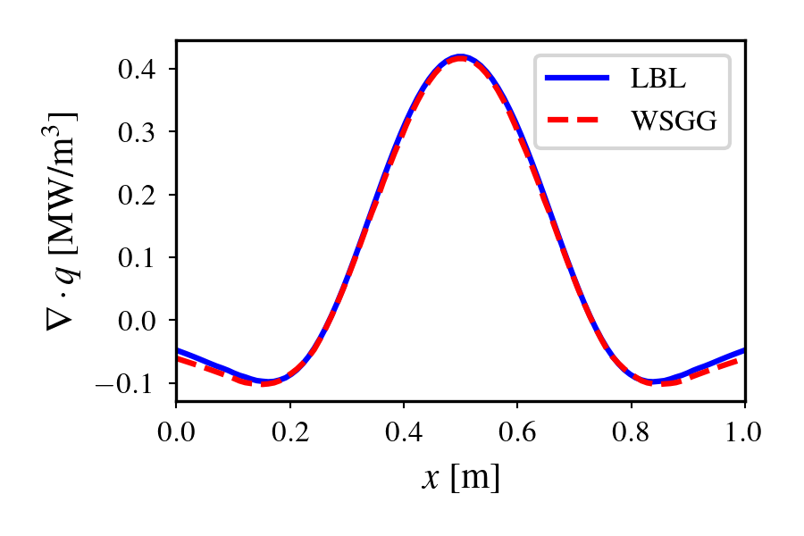

# PINN-WSGG Demo Repository

This repository contains a demonstration of the Physics-Informed Neural Network (PINN)-based Weighted Sum of Gray Gases (WSGG) model implementation.

Key features demonstrated:
- PINN-WSGG model implementation
- 1D Radiative Transfer Equation (RTE) solver
- Comparison with Line-by-Line (LBL) benchmarks

## Installation

```bash
pip install -r requirements.txt
```

## Usage

Run the demo script:
```bash
python pinn_wsgg_demo.py
```

This will:
1. Load the pre-trained PINN-WSGG model from `pinn_wsgg/data/wsgg.json`
2. Solve a 1D RTE problem
3. Compare results with LBL solution
4. Generate comparison plots

## Demo Output



## Project Structure

```
pinn_wsgg/          # Core implementation
├── nn_wsgg.py      # Neural network WSGG model
├── mlp.py          # Multi-layer perceptron
├── rte.py          # Radiative transfer solver
├── plot_setup.py   # Plotting configuration
└── data/           # Model data
    └── wsgg.json   # Pre-trained model parameters

pinn_wsgg_demo.py   # Demonstration script
data/               # Output data
    ├── profiles.npy  # Solution profiles
    └── results.npy   # Comparison results
```

## License

MIT License - See LICENSE file for details.
